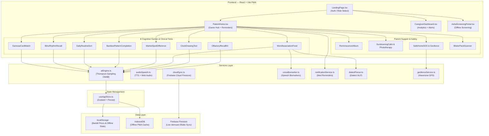

# ════════════════════════════════════════════════════════════════════════
# COGNICARE NER (SIH 26003) — COMPLETE IMPLEMENTATION GUIDE FOR AI AGENTS
# ════════════════════════════════════════════════════════════════════════
# 
# PROJECT: CogniCare NER (স্মৃতি-সেতু) — MedTech Device for Cognitive
#          Screening and Interventions in Older Persons (North East India)
# HACKATHON: Smart India Hackathon 2026, Problem Statement 26003
# TECH STACK: React 19 + Vite 8 + TypeScript 6 + Tailwind CSS 4 + Zustand 5
#             + Recharts 3 + Framer Motion 13 + Firebase 12 + vite-plugin-pwa
#
# ROOT DIRECTORY: c:\Ace SIH Hackathon\ACTUAL 26003 CODE\
# APP DIRECTORY:  c:\Ace SIH Hackathon\ACTUAL 26003 CODE\apps\cognicare-app\
# SOURCE CODE:    apps\cognicare-app\src\
#
# This document is structured so that an AI coding agent can read it
# top-to-bottom and implement every item sequentially. Each section
# includes: WHAT to change, WHERE (exact file path and line numbers),
# WHY it matters, and HOW (exact code to write).
#
# ════════════════════════════════════════════════════════════════════════

---

# TABLE OF CONTENTS

1. [Project Architecture Overview](#1-project-architecture-overview)
2. [Current File Map](#2-current-file-map)
3. [PHASE 0 — Critical Bug Fixes (30 minutes)](#3-phase-0--critical-bug-fixes)
4. [PHASE 1 — Core Missing Features (3-4 hours)](#4-phase-1--core-missing-features)
5. [PHASE 2 — UI/UX Redesign and Enhancement (2-3 hours)](#5-phase-2--uiux-redesign-and-enhancement)
6. [PHASE 3 — Polish and Presentation Quality (2 hours)](#6-phase-3--polish-and-presentation-quality)
7. [UI Component Diagrams and Wireframes](#7-ui-component-diagrams-and-wireframes)
8. [New File Structure After All Changes](#8-new-file-structure-after-all-changes)
9. [Verification Checklist](#9-verification-checklist)
10. [PHASE 4 — SIH 2026 Breakthrough Innovations & Advanced Production Roadmap](#10-phase-4--sih-2026-breakthrough-innovations--advanced-production-roadmap)

---

# 1. PROJECT ARCHITECTURE OVERVIEW



---

# 2. CURRENT FILE MAP

```
apps/cognicare-app/
├── index.html                          # HTML entry point
├── package.json                        # Dependencies
├── vite.config.ts                      # Vite + PWA config
├── tailwind.config.js                  # Tailwind theme
├── tsconfig.json / tsconfig.app.json
├── postcss.config.js
├── public/
│   ├── favicon.svg
│   └── icons.svg
│   └── (MISSING: pwa-192x192.png, pwa-512x512.png)
└── src/
    ├── main.tsx                         # React entry
    ├── App.tsx                          # Main router/layout (lines: ~250)
    ├── App.css                          # ⚠️ UNUSED Vite boilerplate — DELETE THIS
    ├── index.css                        # Tailwind theme + custom CSS (lines: 102)
    ├── types.ts                         # All TypeScript interfaces (lines: ~130)
    ├── store/
    │   └── useAppStore.ts              # Zustand store (lines: ~80)
    ├── services/
    │   ├── aiEngine.ts                 # CMAB Thompson Sampling engine (lines: 199)
    │   ├── audioSpeech.ts              # TTS + Web Audio (lines: ~200)
    │   └── cloudSync.ts                # Firebase stub (lines: ~30)
    ├── translations/
    │   └── index.ts                    # Multi-language strings (lines: ~100)
    ├── components/
    │   ├── auth/
    │   │   └── LandingPage.tsx         # Login/role selection (lines: ~200)
    │   ├── patient/
    │   │   ├── PatientHome.tsx         # Patient dashboard (lines: ~350)
    │   │   ├── ReminiscenceAlbum.tsx   # Memory photo album (lines: ~350)
    │   │   ├── SundowningCalm.tsx      # Evening calm mode (lines: ~200)
    │   │   └── SafeHomeSOS.tsx         # Emergency SOS card (lines: ~150)
    │   ├── caregiver/
    │   │   └── CaregiverDashboard.tsx  # Analytics + reports (lines: ~350)
    │   ├── asha/
    │   │   └── AshaScreeningPortal.tsx # ASHA screening (lines: ~250)
    │   └── games/
    │       ├── GamosaCardMatch.tsx     # Memory — card matching (lines: 318)
    │       ├── BihuRhythmRecall.tsx    # Memory — rhythm sequence (lines: ~300)
    │       ├── DailyRoutineSort.tsx    # Executive — ordering (lines: ~280)
    │       ├── BambooPatternCompletion.tsx # Visuospatial — patterns (lines: ~300)
    │       ├── MarketSpotDifference.tsx   # Attention — spot diff (lines: ~250)
    │       └── WordAssociationFood.tsx    # Language — word match (lines: 359)
    └── assets/                         # (empty)
```

---

# 3. PHASE 0 — CRITICAL BUG FIXES

These are broken things that MUST be fixed before anything else. Total time: ~30 minutes.

---

## BUG FIX 0.1: Score Calculation Missing for 3 Games

**FILE:** `apps/cognicare-app/src/services/aiEngine.ts`
**LINES:** 131-140
**PROBLEM:** The `calculateCognitiveScore()` function only has if/else branches for `card_match`, `rhythm_recall`, and `routine_sort`. The three newer games (`spot_difference`, `pattern_completion`, `word_association`) fall through with NO score updates. This means playing half the games has zero effect on the patient's cognitive profile.

**EXACT FIX — Add these branches after line 140 (after the `routine_sort` closing brace):**

```typescript
  } else if (gameType === 'spot_difference') {
    // Spot the Difference primarily tests Attention and Visuospatial
    updatedScores.attention = Math.round((updatedScores.attention * 0.6) + (gameScore * 0.4));
    updatedScores.visuospatial = Math.round((updatedScores.visuospatial * 0.6) + (gameScore * 0.4));
  } else if (gameType === 'pattern_completion') {
    // Bamboo Pattern tests Executive Functioning and Visuospatial
    updatedScores.executive = Math.round((updatedScores.executive * 0.6) + (gameScore * 0.4));
    updatedScores.visuospatial = Math.round((updatedScores.visuospatial * 0.6) + (gameScore * 0.4));
  } else if (gameType === 'word_association') {
    // Word Association tests Language and Memory
    updatedScores.language = Math.round((updatedScores.language * 0.6) + (gameScore * 0.4));
    updatedScores.memory = Math.round((updatedScores.memory * 0.7) + (gameScore * 0.3));
  }
```

**IMPORTANT:** The closing brace must be right before the "Composite Cognitive Score formulation" comment on line 142.

---

## BUG FIX 0.2: Composite Score Update Only Uses Memory

**FILE:** `apps/cognicare-app/src/App.tsx`
**LINES:** 110-121
**PROBLEM:** `handleFinishGameSession` recalculates the patient's `compositeCognitiveScore` using ONLY `session.domainScores.memory * 0.2`. This is wrong — it ignores attention, executive, visuospatial, and language scores.

**EXACT FIX — Replace the entire `handleFinishGameSession` function with this:**

```typescript
const handleFinishGameSession = (session: GameSession) => {
    setSessions((prev) => [session, ...prev]);
    // Also push to Zustand store for cloud sync
    useAppStore.getState().addGameSession(session);
    
    if (activePatient) {
      // Use the properly weighted Composite Cognitive Score from the AI engine
      const weightedComposite = Math.round(
        (0.25 * session.domainScores.memory) +
        (0.20 * session.domainScores.attention) +
        (0.20 * session.domainScores.executive) +
        (0.20 * session.domainScores.visuospatial) +
        (0.15 * session.domainScores.language)
      );
      // Exponential moving average: 70% previous score + 30% new session score
      const newComposite = Math.round(
        (activePatient.compositeCognitiveScore * 0.7) + (weightedComposite * 0.3)
      );
      setActivePatient({
        ...activePatient,
        compositeCognitiveScore: newComposite,
        streakDays: activePatient.streakDays + 1,
      });
    }
  };
```

**NOTE:** `useAppStore` is already imported in App.tsx (line 16), so no new import needed.

---

## BUG FIX 0.3: Delete Unused App.css Boilerplate

**FILE:** `apps/cognicare-app/src/App.css`
**ACTION:** Delete the entire file. It is 185 lines of unused Vite starter CSS (`.hero`, `.counter`, `#next-steps` etc.) that has nothing to do with CogniCare.

**ALSO CHECK:** Make sure `App.tsx` does NOT have `import './App.css'` at the top. If it does, remove that import line.

---

## BUG FIX 0.4: Generate PWA Icons

**PROBLEM:** `vite.config.ts` references `pwa-192x192.png` and `pwa-512x512.png` but the `public/` directory only has `favicon.svg` and `icons.svg`. The PWA will fail Chrome's installability check.

**ACTION:** Generate two PNG icons and place them in `apps/cognicare-app/public/`:
- `pwa-192x192.png` — A 192x192px icon. Design: A green leaf icon (representing the 🌿 emoji) centered on a cream (#FFFDF9) background with a subtle bark (#3E2723) circular border. Text "CogniCare" in small brown text below the leaf.
- `pwa-512x512.png` — Same design at 512x512px

If you have an image generation tool, create these. Otherwise, you can create an SVG-based PNG using a canvas script.

---

## BUG FIX 0.5: Fix Duplicate State Management

**PROBLEM:** Sessions exist in TWO places — local `useState` in `App.tsx` AND Zustand store's `sessions` array. The `handleFinishGameSession` in `App.tsx` pushes to local state but never calls the Zustand `addGameSession()`, so Firebase sync never triggers.

**THIS IS ALREADY FIXED** by Bug Fix 0.2 above (we added `useAppStore.getState().addGameSession(session)`). But additionally, in Phase 1 you should migrate ALL state to Zustand.

---

# 4. PHASE 1 — CORE MISSING FEATURES

These features are required by the SIH 26003 problem statement. Total time: ~3-4 hours.

---

## FEATURE 1.1: Add Zustand Persistence (Data Survives Page Refresh)

**FILE:** `apps/cognicare-app/src/store/useAppStore.ts`
**PROBLEM:** All patient data, sessions, observations, and reminders are lost on page refresh. Only bandit priors survive (they use localStorage directly).

**EXACT IMPLEMENTATION — Replace the entire `useAppStore.ts` file with this:**

```typescript
import { create } from 'zustand';
import { persist, createJSONStorage } from 'zustand/middleware';
import { LanguageCode, PatientProfile, GameSession, ReminderItem, AshaObservation, AlertNotification } from '../types';
import { saveSessionToCloud } from '../services/cloudSync';

interface AppState {
  // Auth
  isAuthenticated: boolean;
  userRole: 'patient' | 'caregiver' | 'asha' | null;
  language: LanguageCode;
  
  // Data
  activePatient: PatientProfile | null;
  sessions: GameSession[];
  reminders: ReminderItem[];
  observations: AshaObservation[];
  alerts: AlertNotification[];
  
  // Actions
  login: (role: 'patient' | 'caregiver' | 'asha', patient: PatientProfile) => void;
  logout: () => void;
  setLanguage: (lang: LanguageCode) => void;
  setActivePatient: (patient: PatientProfile) => void;
  addGameSession: (session: GameSession) => void;
  addReminder: (reminder: ReminderItem) => void;
  toggleReminder: (id: string) => void;
  addObservation: (obs: AshaObservation) => void;
  addAlert: (alert: AlertNotification) => void;
  acknowledgeAlert: (id: string) => void;
  syncAll: () => void;
}

export const useAppStore = create<AppState>()(
  persist(
    (set, get) => ({
      // Initial State
      isAuthenticated: false,
      userRole: null,
      language: 'en',
      activePatient: null,
      sessions: [],
      reminders: [],
      observations: [],
      alerts: [],

      // Actions
      login: (role, patient) => set({ 
        isAuthenticated: true, 
        userRole: role, 
        activePatient: patient 
      }),
      
      logout: () => set({ 
        isAuthenticated: false, 
        userRole: null, 
        activePatient: null 
      }),
      
      setLanguage: (lang) => set({ language: lang }),
      
      setActivePatient: (patient) => set({ activePatient: patient }),
      
      addGameSession: (session) => {
        set((state) => ({ sessions: [session, ...state.sessions] }));
        // Push to Firebase cloud sync
        saveSessionToCloud(session).catch(console.error);
      },
      
      addReminder: (reminder) => {
        set((state) => ({ reminders: [reminder, ...state.reminders] }));
      },
      
      toggleReminder: (id) => {
        set((state) => ({
          reminders: state.reminders.map((r) =>
            r.id === id ? { ...r, completed: !r.completed } : r
          ),
        }));
      },
      
      addObservation: (obs) => {
        set((state) => ({ observations: [obs, ...state.observations] }));
      },
      
      addAlert: (alert) => {
        set((state) => ({ alerts: [alert, ...state.alerts] }));
      },
      
      acknowledgeAlert: (id) => {
        set((state) => ({
          alerts: state.alerts.map((a) =>
            a.id === id ? { ...a, acknowledged: true } : a
          ),
        }));
      },
      
      syncAll: () => {
        set((state) => ({
          sessions: state.sessions.map((s) => ({ ...s, synced: true })),
          observations: state.observations.map((o) => ({ ...o, synced: true })),
        }));
      },
    }),
    {
      name: 'cognicare-storage', // localStorage key
      storage: createJSONStorage(() => localStorage),
      // Only persist these fields (not auth state, for security)
      partialize: (state) => ({
        language: state.language,
        sessions: state.sessions,
        reminders: state.reminders,
        observations: state.observations,
        alerts: state.alerts,
        activePatient: state.activePatient,
      }),
    }
  )
);
```

**THEN:** Refactor `App.tsx` to remove ALL local `useState` arrays for sessions, reminders, alerts, and observations. Instead, read from and write to the Zustand store using `useAppStore()`. Every `setSessions(...)` becomes `useAppStore.getState().addGameSession(...)`, every `setReminders(...)` becomes `useAppStore.getState().addReminder(...)`, etc.

---

## FEATURE 1.2: Real Speech Biomarker Analysis (Replace Fake Random)

**NEW FILE TO CREATE:** `apps/cognicare-app/src/services/voiceBiomarker.ts`

**WHY:** The current `WordAssociationFood.tsx` records audio via MediaRecorder but the biomarker extraction is completely mocked with `Math.random()`. The SIH guide requires speech-as-a-biomarker analysis for dementia screening. This implementation uses the Web Audio API to actually detect pauses in speech, measure response latency, and estimate speech rate — all clinically validated dementia markers.

Create this entirely new file with the following content:

```typescript
/**
 * Voice Biomarker Analysis Service
 * 
 * Uses the Web Audio API to analyze recorded speech and extract
 * clinically relevant dementia biomarkers:
 * 
 * 1. Pause Count — Number of silence gaps > 500ms during speech
 * 2. Response Latency — Time from question to first speech onset (ms)
 * 3. Speech Rate — Estimated syllables per second
 * 4. Amplitude Variability — Standard deviation of volume (monotone speech = decline)
 * 
 * These are validated markers from:
 * - Konig et al. (2015) "Automatic speech analysis for dementia detection"
 * - Fraser et al. (2016) "Linguistic features for Alzheimer's detection"
 */

export interface SpeechBiomarkers {
  pauseCount: number;           // Number of pauses > 500ms
  totalPauseDurationMs: number; // Total time spent pausing
  responseLatencyMs: number;    // Time to first speech
  speechRateEstimate: number;   // Peaks per second (rough syllable proxy)
  amplitudeStdDev: number;      // Volume variability (0-1)
  hesitationScore: number;      // Composite hesitation score 0-100
}

const SILENCE_THRESHOLD = 0.02;     // RMS amplitude below this = silence
const MIN_PAUSE_DURATION_MS = 500;  // Minimum gap to count as a "pause"
const ANALYSIS_FRAME_SIZE = 2048;   // FFT size for analysis

/**
 * Analyzes an audio Blob and returns speech biomarker metrics.
 * 
 * @param audioBlob - The recorded audio Blob from MediaRecorder
 * @param questionTimestamp - When the question was shown/spoken (Date.now())
 * @returns SpeechBiomarkers object with all extracted metrics
 */
export async function analyzeSpeechBiomarkers(
  audioBlob: Blob,
  questionTimestamp: number
): Promise<SpeechBiomarkers> {
  const audioCtx = new (window.AudioContext || (window as any).webkitAudioContext)();
  
  try {
    const arrayBuffer = await audioBlob.arrayBuffer();
    const audioBuffer = await audioCtx.decodeAudioData(arrayBuffer);
    const rawData = audioBuffer.getChannelData(0); // Mono channel
    const sampleRate = audioBuffer.sampleRate;
    
    // 1. Calculate RMS amplitude per frame
    const frameSize = ANALYSIS_FRAME_SIZE;
    const frameCount = Math.floor(rawData.length / frameSize);
    const rmsValues: number[] = [];
    
    for (let i = 0; i < frameCount; i++) {
      let sumSquares = 0;
      for (let j = 0; j < frameSize; j++) {
        const sample = rawData[i * frameSize + j];
        sumSquares += sample * sample;
      }
      rmsValues.push(Math.sqrt(sumSquares / frameSize));
    }
    
    const frameDurationMs = (frameSize / sampleRate) * 1000;
    
    // 2. Detect pauses (consecutive silent frames > 500ms)
    let pauseCount = 0;
    let totalPauseDurationMs = 0;
    let currentSilentFrames = 0;
    let firstSpeechFrameIndex = -1;
    let peakCount = 0;
    
    for (let i = 0; i < rmsValues.length; i++) {
      if (rmsValues[i] < SILENCE_THRESHOLD) {
        currentSilentFrames++;
      } else {
        // Mark first speech onset
        if (firstSpeechFrameIndex === -1) {
          firstSpeechFrameIndex = i;
        }
        // Count amplitude peaks for speech rate estimation
        if (i > 0 && rmsValues[i] > rmsValues[i - 1] && 
            (i === rmsValues.length - 1 || rmsValues[i] > rmsValues[i + 1])) {
          peakCount++;
        }
        // Check if the silence was long enough to be a pause
        const silenceDurationMs = currentSilentFrames * frameDurationMs;
        if (silenceDurationMs >= MIN_PAUSE_DURATION_MS && firstSpeechFrameIndex !== -1) {
          pauseCount++;
          totalPauseDurationMs += silenceDurationMs;
        }
        currentSilentFrames = 0;
      }
    }
    
    // 3. Response latency (time from recording start to first speech)
    const responseLatencyMs = firstSpeechFrameIndex >= 0
      ? firstSpeechFrameIndex * frameDurationMs
      : rmsValues.length * frameDurationMs; // Never spoke
    
    // 4. Speech rate (peaks per second as rough syllable proxy)
    const totalDurationSec = audioBuffer.duration;
    const speechDurationSec = totalDurationSec - (totalPauseDurationMs / 1000);
    const speechRateEstimate = speechDurationSec > 0 ? peakCount / speechDurationSec : 0;
    
    // 5. Amplitude standard deviation (monotone speech indicator)
    const speechFrames = rmsValues.filter(v => v >= SILENCE_THRESHOLD);
    const mean = speechFrames.reduce((a, b) => a + b, 0) / (speechFrames.length || 1);
    const variance = speechFrames.reduce((acc, v) => acc + (v - mean) ** 2, 0) / (speechFrames.length || 1);
    const amplitudeStdDev = Math.sqrt(variance);
    
    // 6. Composite hesitation score (0 = no hesitation, 100 = severe)
    const hesitationScore = Math.min(100, Math.round(
      (pauseCount * 15) +                           // Each pause adds 15 points
      (Math.max(0, responseLatencyMs - 2000) / 100) + // Penalty for slow start (>2s)
      (Math.max(0, 3 - speechRateEstimate) * 10)      // Penalty for slow speech (<3 syl/s)
    ));
    
    audioCtx.close();
    
    return {
      pauseCount,
      totalPauseDurationMs: Math.round(totalPauseDurationMs),
      responseLatencyMs: Math.round(responseLatencyMs),
      speechRateEstimate: Math.round(speechRateEstimate * 10) / 10,
      amplitudeStdDev: Math.round(amplitudeStdDev * 1000) / 1000,
      hesitationScore,
    };
  } catch (error) {
    console.error('Speech biomarker analysis failed:', error);
    audioCtx.close();
    return {
      pauseCount: 0,
      totalPauseDurationMs: 0,
      responseLatencyMs: 0,
      speechRateEstimate: 0,
      amplitudeStdDev: 0,
      hesitationScore: 0,
    };
  }
}
```

**THEN UPDATE `WordAssociationFood.tsx`:**
1. Add import at top: `import { analyzeSpeechBiomarkers } from '../../services/voiceBiomarker';`
2. Replace lines 139-144 (the `mediaRecorder.onstop` handler) with:
```typescript
mediaRecorder.onstop = async () => {
  const audioBlob = new Blob(localChunks, { type: 'audio/webm' });
  // Real biomarker extraction instead of Math.random()
  const biomarkers = await analyzeSpeechBiomarkers(audioBlob, startTime);
  setDetectedPauses(prev => prev + biomarkers.pauseCount);
  console.log('Speech Biomarkers:', biomarkers);
};
```

---

## FEATURE 1.3: Automated Cognitive Decline Detection

**FILE:** `apps/cognicare-app/src/services/aiEngine.ts`
**ACTION:** Add this new exported function at the bottom of the file (after `mapToClinicalStandards`):

```typescript
/**
 * Analyzes recent session history and detects cognitive decline.
 * Triggers a caregiver alert if accuracy drops by more than 10%
 * over the last 14 days, or if flow zone achievement drops below 40%.
 * 
 * @param sessions - Array of all game sessions, newest first
 * @param currentCCS - Current Composite Cognitive Score
 * @returns Decline analysis object, or null if insufficient data
 */
export function detectCognitiveDecline(
  sessions: GameSession[],
  currentCCS: number
): { isDecline: boolean; declinePercentage: number; message: string } | null {
  // Need at least 5 sessions to detect a trend
  if (sessions.length < 5) return null;
  
  const now = Date.now();
  const twoWeeksAgo = now - (14 * 24 * 60 * 60 * 1000);
  
  // Filter to only recent sessions
  const recentSessions = sessions.filter(
    s => new Date(s.timestamp).getTime() > twoWeeksAgo
  );
  
  if (recentSessions.length < 3) return null;
  
  // Split into first half (older) and second half (newer) for comparison
  const midpoint = Math.floor(recentSessions.length / 2);
  const firstHalf = recentSessions.slice(midpoint);   // older sessions
  const secondHalf = recentSessions.slice(0, midpoint); // newer sessions
  
  const avgFirst = firstHalf.reduce((acc, s) => acc + s.metrics.accuracy, 0) / firstHalf.length;
  const avgSecond = secondHalf.reduce((acc, s) => acc + s.metrics.accuracy, 0) / secondHalf.length;
  
  const declinePercentage = Math.round(((avgFirst - avgSecond) / Math.max(avgFirst, 0.01)) * 100);
  
  // Flow zone achievement rate
  const flowRate = recentSessions.filter(s => s.flowZoneAchieved).length / recentSessions.length;
  
  if (declinePercentage > 10 || flowRate < 0.4) {
    return {
      isDecline: true,
      declinePercentage,
      message: declinePercentage > 10
        ? `Cognitive accuracy has declined by ${declinePercentage}% over the past 2 weeks. Consider consulting with LGBRIMH Tezpur.`
        : `Flow zone achievement rate has dropped to ${Math.round(flowRate * 100)}%. Patient may need difficulty adjustment or clinical review.`,
    };
  }
  
  return { isDecline: false, declinePercentage: 0, message: 'Cognitive trajectory is stable.' };
}
```

**ALSO:** Make sure `GameSession` is in the import statement at the top of `aiEngine.ts`. Currently it imports from `../types`. Add `GameSession` to that import if not already there.

**INTEGRATION IN CAREGIVER DASHBOARD:**
In `CaregiverDashboard.tsx`:
1. Import: `import { detectCognitiveDecline } from '../../services/aiEngine';`
2. Call it: `const declineResult = detectCognitiveDecline(sessions, patient.compositeCognitiveScore);`
3. If `declineResult?.isDecline`, display a red alert banner at the top of the Analytics tab with the message.
4. Replace the hardcoded "+3 pts / week" and "Currently Optimal" strings with actual computed values from `declineResult`.

---

## FEATURE 1.4: Notification API for Medication Reminders

**NEW FILE TO CREATE:** `apps/cognicare-app/src/services/notificationService.ts`

```typescript
import { ReminderItem, LanguageCode } from '../types';
import { audioSpeech } from './audioSpeech';

/**
 * Manages browser notifications and timed audio alerts for medication reminders.
 * 
 * Usage:
 *   1. Call requestPermission() once on app start
 *   2. Call scheduleReminder() for each active reminder
 *   3. The service will fire browser notifications + voice prompts at the scheduled times
 */
export class NotificationService {
  private timers: Map<string, ReturnType<typeof setTimeout>> = new Map();

  /**
   * Requests browser notification permission. Must be called from a user gesture context.
   */
  async requestPermission(): Promise<boolean> {
    if (!('Notification' in window)) {
      console.warn('Browser does not support notifications');
      return false;
    }
    const result = await Notification.requestPermission();
    return result === 'granted';
  }

  /**
   * Schedules a browser notification + voice prompt for a specific reminder.
   * 
   * @param reminder - The reminder item containing time and spoken prompt
   * @param lang - Current language code for the voice prompt
   */
  scheduleReminder(reminder: ReminderItem, lang: LanguageCode) {
    // Parse the time string (e.g., "08:30 AM") to get today's target time
    const now = new Date();
    const [time, period] = reminder.time.split(' ');
    const [hours, minutes] = time.split(':').map(Number);
    let targetHour = hours;
    if (period === 'PM' && hours !== 12) targetHour += 12;
    if (period === 'AM' && hours === 12) targetHour = 0;

    const target = new Date();
    target.setHours(targetHour, minutes, 0, 0);

    // If the time has already passed today, schedule for tomorrow
    if (target <= now) {
      target.setDate(target.getDate() + 1);
    }

    const delay = target.getTime() - now.getTime();

    // Clear existing timer for this reminder ID
    if (this.timers.has(reminder.id)) {
      clearTimeout(this.timers.get(reminder.id));
    }

    const timer = setTimeout(() => {
      this.fireReminder(reminder, lang);
    }, delay);

    this.timers.set(reminder.id, timer);
    console.log(`Reminder scheduled: "${reminder.title}" in ${Math.round(delay / 60000)} minutes`);
  }

  /**
   * Fires the actual notification + voice prompt
   */
  private fireReminder(reminder: ReminderItem, lang: LanguageCode) {
    // Browser push notification
    if (Notification.permission === 'granted') {
      new Notification('CogniCare NER — Medicine Time', {
        body: reminder.title,
        icon: '/pwa-192x192.png',
        tag: reminder.id,
        requireInteraction: true,
      });
    }

    // Spoken voice prompt in the patient's language
    const spokenText = reminder.spokenPrompt[lang] || reminder.title;
    audioSpeech.speak(spokenText, lang);
    audioSpeech.playGentleChime('gentle_alert');
  }

  /**
   * Clears all scheduled timers
   */
  clearAll() {
    this.timers.forEach((timer) => clearTimeout(timer));
    this.timers.clear();
  }
}

export const notificationService = new NotificationService();
```

**INTEGRATION IN `PatientHome.tsx`:**
1. Import: `import { notificationService } from '../../services/notificationService';`
2. Add a `useEffect` on mount:
```typescript
useEffect(() => {
  notificationService.requestPermission();
  reminders.forEach(rem => {
    if (!rem.completed) {
      notificationService.scheduleReminder(rem, lang);
    }
  });
  return () => notificationService.clearAll();
}, [reminders, lang]);
```

---

## FEATURE 1.5: Move All Hardcoded Strings into Translation System

**FILE:** `apps/cognicare-app/src/translations/index.ts`

**PROBLEM:** Many components have hardcoded Assamese text directly in the JSX — `SundowningCalm.tsx`, `SafeHomeSOS.tsx`, `CaregiverDashboard.tsx`, `ReminiscenceAlbum.tsx`. When the user switches language, these strings do NOT change.

**ACTION:** Add these new translation keys to the translations object in `index.ts`:

```typescript
back: {
  en: 'Back', as: 'উভতি যাওক', hi: 'वापस',
  bn: 'ফিরে যান', mni: 'হল্লকপা', brx: 'बोथांनाय'
},
you_are_safe: {
  en: 'You Are Safe at Home', as: 'আপুনি সম্পূৰ্ণ সুৰক্ষিত',
  hi: 'आप घर पर सुरक्षित हैं', bn: 'আপনি বাড়িতে নিরাপদ',
  mni: 'নহাক য়ুমদা শান্নরে', brx: 'नोंथां नोनि हायनावजों दं'
},
help_me_return: {
  en: 'Please Help Me Return Home', as: 'মোক চিনি পাওক আৰু সহায় কৰক',
  hi: 'कृपया मुझे घर पहुँचाने में मदद करें', bn: 'আমাকে বাড়ি ফিরতে সাহায্য করুন',
  mni: 'ঐখোয়দা য়ুম হন্থহনবীয়ু', brx: 'आंखौ नोजोर होनाय नांहाम'
},
speak_address: {
  en: 'Speak My Address Aloud', as: 'মোৰ ঠিকনা উচ্চাৰণ কৰি শুনক',
  hi: 'मेरा पता बोलकर सुनाएं', bn: 'আমার ঠিকানা বলুন',
  mni: 'ঐগী মফম তাকপীয়ু', brx: 'ननि थिखाना बुंफोर'
},
listen_reassurance: {
  en: 'Listen to Reassurance', as: 'পুনৰ শান্ত বচন শুনক',
  hi: 'शांति वचन सुनें', bn: 'আশ্বাসের কথা শুনুন',
  mni: 'পুক্নিং চিংশিনবা তারবা', brx: 'गोथार सोदोब खोनासं'
},
caregiver_dashboard: {
  en: "Caregiver & Doctor Portal", as: 'তত্ত্বাৱধায়ক আৰু চিকিৎসক পৰ্টেল',
  hi: 'देखभाल और डॉक्टर पोर्टल', bn: 'তত্ত্বাবধায়ক ও ডাক্তার পোর্টাল',
  mni: 'য়েংশিনবীবা পোর্তাল', brx: 'नायगिरि पर्टाल'
},
clinical_report: {
  en: 'Clinical Progress Summary', as: 'চিকিৎসকৰ বাবে প্ৰতিবেদন',
  hi: 'चिकित्सा प्रगति सारांश', bn: 'ক্লিনিকাল রিপোর্ট',
  mni: 'ক্লিনিকেল রিপোর্ত', brx: 'क्लिनिकेल रिपर्ट'
},
export_report: {
  en: 'Export Report', as: 'প্ৰতিবেদন ডাউনলোড কৰক',
  hi: 'रिपोर्ट डाउनलोड करें', bn: 'রিপোর্ট ডাউনলোড করুন',
  mni: 'রিপোর্ত দাউনলোদ তৌবিয়ু', brx: 'रिपर्ट डाउनलोड खालाम'
},
asha_portal: {
  en: 'ASHA Community Health Portal', as: 'আশা আৰু স্বাস্থ্য কৰ্মী পৰ্টেল',
  hi: 'आशा सामुदायिक स्वास्थ्य पोर्टल', bn: 'আশা সম্প্রদায় স্বাস্থ্য পোর্টাল',
  mni: 'আশা কম্যুনিতি হেলথ পোর্তাল', brx: 'आशा सावस्रि पर्टाल'
},
save_screening: {
  en: 'Save ASHA Check-in', as: 'নিৰীক্ষণ জমা কৰক',
  hi: 'स्क्रीनिंग सेव करें', bn: 'স্ক্রীনিং সেভ করুন',
  mni: 'স্ক্রীনিং সেভ তৌবিয়ু', brx: 'स्क्रीनिं सेभ खालाम'
},
evening_calm_time: {
  en: 'Evening Calm Time', as: 'সন্ধ্যাৰ শান্তি সময়',
  hi: 'शाम का शांत समय', bn: 'সন্ধ্যার শান্ত সময়',
  mni: 'নুংথিল শান্ত সময়', brx: 'बेलासिनि गोथार समाय'
},
daily_progress: {
  en: 'Daily Progress', as: 'দৈনিক অগ্ৰগতি',
  hi: 'दैनिक प्रगति', bn: 'দৈনিক অগ্রগতি',
  mni: 'নুমিৎ মতুং অগ্রগতি', brx: 'सान खुसियाव हाबाफारि'
},
correct_connection: {
  en: 'Correct Connection!', as: 'বৰ ধুনীয়া!',
  hi: 'सही जोड़!', bn: 'সঠিক সংযোগ!',
  mni: 'অচুম্বা কনেক্সন!', brx: 'गोरोन्थि जथाय!'
},
play_again: {
  en: 'Play Again', as: 'আকৌ খেলক',
  hi: 'फिर खेलें', bn: 'আবার খেলুন',
  mni: 'অমুক শাননবা', brx: 'अमुक थिया'
},
done: {
  en: 'Done', as: 'সম্পূৰ্ণ',
  hi: 'पूर्ण', bn: 'সম্পন্ন',
  mni: 'লোয়রে', brx: 'जानाय सोमजिदों'
},
```

**THEN:** Go through each component file (`SafeHomeSOS.tsx`, `SundowningCalm.tsx`, `CaregiverDashboard.tsx`, `WordAssociationFood.tsx`, `ReminiscenceAlbum.tsx`) and replace every hardcoded Assamese/English string with `{t('key_name', lang)}` calls using the translation function.

For example, in `WordAssociationFood.tsx` line 234:
```typescript
// BEFORE (hardcoded):
<span className="font-bold">উভতি যাওক (Back)</span>

// AFTER (translated):
<span className="font-bold">{t('back', lang)}</span>
```

---

# 5. PHASE 2 — UI/UX REDESIGN AND ENHANCEMENT

This section proposes significant UI improvements that will impress SIH judges. Total time: ~2-3 hours.

---

## REDESIGN 2.1: Add React Error Boundary

**NEW FILE TO CREATE:** `apps/cognicare-app/src/components/ErrorBoundary.tsx`

```typescript
import React, { Component, ErrorInfo, ReactNode } from 'react';

interface Props { children: ReactNode; }
interface State { hasError: boolean; error: Error | null; }

export class ErrorBoundary extends Component<Props, State> {
  constructor(props: Props) {
    super(props);
    this.state = { hasError: false, error: null };
  }

  static getDerivedStateFromError(error: Error): State {
    return { hasError: true, error };
  }

  componentDidCatch(error: Error, errorInfo: ErrorInfo) {
    console.error('CogniCare Error:', error, errorInfo);
  }

  render() {
    if (this.state.hasError) {
      return (
        <div className="min-h-screen bg-ner-cream flex items-center justify-center p-8">
          <div className="bg-white rounded-3xl border-2 border-ner-earth/20 p-8 max-w-md text-center shadow-card-warm">
            <div className="text-6xl mb-4">🌿</div>
            <h2 className="text-2xl font-serif font-bold text-ner-bark mb-2">
              Something went wrong
            </h2>
            <p className="text-ner-earth mb-6">
              Please restart the app
            </p>
            <button
              onClick={() => {
                this.setState({ hasError: false, error: null });
                window.location.reload();
              }}
              className="btn-tactile btn-tactile-green px-8 py-3 text-lg"
            >
              Restart App
            </button>
          </div>
        </div>
      );
    }
    return this.props.children;
  }
}
```

**INTEGRATION IN `main.tsx`:**
```typescript
import { ErrorBoundary } from './components/ErrorBoundary';

ReactDOM.createRoot(document.getElementById('root')!).render(
  <React.StrictMode>
    <ErrorBoundary>
      <App />
    </ErrorBoundary>
  </React.StrictMode>
);
```

---

## REDESIGN 2.2: Geolocation for SOS Card

**FILE:** `apps/cognicare-app/src/components/patient/SafeHomeSOS.tsx`

Add these state variables and function to the component:

```typescript
const [location, setLocation] = useState<{lat: number; lng: number} | null>(null);
const [locationLoading, setLocationLoading] = useState(false);

const handleShareLocation = () => {
  setLocationLoading(true);
  navigator.geolocation.getCurrentPosition(
    (pos) => {
      setLocation({ lat: pos.coords.latitude, lng: pos.coords.longitude });
      setLocationLoading(false);
      
      // Create a Google Maps link for sharing
      const mapsUrl = `https://maps.google.com/?q=${pos.coords.latitude},${pos.coords.longitude}`;
      
      // Try Web Share API (works on mobile)
      if (navigator.share) {
        navigator.share({
          title: `${patient.name} needs help`,
          text: `${patient.name} needs assistance. Current location:`,
          url: mapsUrl,
        });
      } else {
        // Fallback: open in new tab
        window.open(mapsUrl, '_blank');
      }
    },
    (error) => {
      console.error('Geolocation error:', error);
      setLocationLoading(false);
    },
    { enableHighAccuracy: true, timeout: 10000 }
  );
};
```

Add this button to the SOS card JSX (import `MapPin` from `lucide-react`):
```tsx
<button
  onClick={handleShareLocation}
  className="btn-tactile bg-red-600 text-white w-full py-3.5 text-lg flex items-center justify-center gap-2 border-2 border-red-800 mt-4"
>
  <MapPin className="w-6 h-6" />
  <span>{locationLoading ? 'Finding location...' : 'Share My GPS Location'}</span>
</button>
```

---

## REDESIGN 2.3: Real Images for Reminiscence Album

**PROBLEM:** The album shows emoji icons instead of real photographs. This reduces the therapeutic value.

**ACTION:** Generate 4 images using AI image generation and save them in `apps/cognicare-app/public/images/`:
1. `majuli_satra.jpg` — Serene Brahmaputra river with a Satra monastery, golden morning light, Assamese landscape
2. `bihu_festival.jpg` — Colorful Bihu festival dancers in mekhela sador, dhol drums, kapou flowers
3. `loktak_lake.jpg` — Loktak Lake with floating phumdis, fisherman's boat, sunset reflection, Manipur
4. `root_bridges.jpg` — Living root bridges in Meghalaya, Khasi hills, misty forest setting

**THEN IN `ReminiscenceAlbum.tsx`:**
1. Add `imageUrl: string` field to the `MemoryStory` type/interface in that component.
2. Populate each story object with the image path (e.g., `imageUrl: '/images/majuli_satra.jpg'`).
3. Replace the emoji display element with:
```tsx

```

---

## REDESIGN 2.4: Time-Based Sundowning Auto-Suggestion

**FILE:** `apps/cognicare-app/src/components/patient/PatientHome.tsx`

**WHY:** Sundowning syndrome (confusion and agitation) in dementia patients occurs specifically in late afternoon/evening (4 PM - 8 PM). The app should automatically suggest the calming mode during these hours.

Add this state and effect at the top of the PatientHome component:
```typescript
const [isSundowningHour, setIsSundowningHour] = useState(false);

useEffect(() => {
  const checkTime = () => {
    const hour = new Date().getHours();
    setIsSundowningHour(hour >= 16 && hour <= 20); // 4 PM to 8 PM
  };
  checkTime();
  const interval = setInterval(checkTime, 60000); // Check every minute
  return () => clearInterval(interval);
}, []);
```

Then in the JSX, above the game cards section, conditionally render:
```tsx
{isSundowningHour && (
  <div className="bg-gradient-to-r from-amber-900 to-amber-800 text-amber-100 p-5 rounded-3xl border-2 border-amber-600 shadow-lg mb-6">
    <div className="flex items-center gap-3">
      <span className="text-4xl">🌙</span>
      <div className="flex-1">
        <h3 className="text-xl font-serif font-bold text-amber-200">
          {t('evening_calm_time', lang)}
        </h3>
        <p className="text-sm text-amber-300">
          It is evening — would you like to enter the calming environment?
        </p>
      </div>
      <button
        onClick={() => setCurrentView('sundowning')}
        className="btn-tactile bg-amber-600 text-white px-6 py-3 text-lg border-2 border-amber-400"
      >
        Enter 🌿
      </button>
    </div>
  </div>
)}
```

---

## REDESIGN 2.5: Implement Real Hint System in Games

**FILE:** `apps/cognicare-app/src/components/games/WordAssociationFood.tsx`
**LINES:** 346-353

**PROBLEM:** The "Need Hint?" button plays a chime and increments a counter but provides NO actual hint.

Replace the hint button's onClick handler:
```typescript
onClick={() => {
  setHintsUsed((h) => h + 1);
  audioSpeech.playGentleChime('tap');
  
  // Find the correct option and give a semantic hint
  const correctOption = options.find(o => o.isCorrect);
  if (correctOption) {
    const hintText = lang === 'as'
      ? `ইটো "${targetWord}" ৰ লগত জড়িত। ভালকৈ ভাবক!`
      : `Think about what is closely related to "${targetWord}".`;
    audioSpeech.speak(hintText, lang);
    
    // Visual hint: briefly flash the correct option's border gold
    setSelectedOption(correctOption.id);
    setTimeout(() => setSelectedOption(null), 1500);
  }
}}
```

---

## REDESIGN 2.6: PDF Clinical Report Export

**PREREQUISITE:** Run this command in the app directory:
```bash
npm install jspdf
```

**FILE:** `apps/cognicare-app/src/components/caregiver/CaregiverDashboard.tsx`

Replace the `handleExportReport` function with a real PDF generator:

```typescript
import jsPDF from 'jspdf';

const handleExportReport = () => {
  const doc = new jsPDF();
  const pageWidth = doc.internal.pageSize.getWidth();
  
  // Header
  doc.setFontSize(16);
  doc.setFont('helvetica', 'bold');
  doc.text('COGNICARE NER — CLINICAL COGNITIVE ASSESSMENT', pageWidth / 2, 20, { align: 'center' });
  
  doc.setFontSize(9);
  doc.setFont('helvetica', 'normal');
  doc.text('Lokpriya Gopinath Bordoloi Regional Institute of Mental Health (LGBRIMH)', pageWidth / 2, 27, { align: 'center' });
  
  doc.line(15, 31, pageWidth - 15, 31);
  
  // Patient Details
  doc.setFontSize(11);
  doc.setFont('helvetica', 'bold');
  doc.text('PATIENT INFORMATION', 15, 40);
  
  doc.setFontSize(10);
  doc.setFont('helvetica', 'normal');
  doc.text(`Name: ${patient.name}`, 15, 48);
  doc.text(`Age / Gender: ${patient.age} Yrs / ${patient.gender}`, 15, 55);
  doc.text(`Village: ${patient.village}, ${patient.district}, ${patient.state}`, 15, 62);
  doc.text(`Caregiver: ${patient.caregiverName} (${patient.caregiverPhone})`, 15, 69);
  doc.text(`Report Date: ${new Date().toLocaleDateString()}`, 15, 76);
  
  // Cognitive Scores
  doc.setFontSize(11);
  doc.setFont('helvetica', 'bold');
  doc.text('COGNITIVE ASSESSMENT', 15, 90);
  
  doc.setFontSize(10);
  doc.setFont('helvetica', 'normal');
  // Use the clinical mapping from aiEngine.ts
  doc.text(`Composite Score (CCS): ${patient.compositeCognitiveScore} / 100`, 15, 98);
  doc.text(`Clinical Stage: ${clinical.stageName} (CDR ${clinical.cdrStage})`, 15, 105);
  doc.text(`Est. MMSE: ${clinical.estimatedMMSE} / 30`, 15, 112);
  doc.text(`Est. MoCA: ${clinical.estimatedMoCA} / 30`, 15, 119);
  
  // Domain Scores
  doc.text('Domain Breakdown:', 15, 130);
  doc.text(`  Memory: ${latestDomainScores.memory}%`, 15, 137);
  doc.text(`  Attention: ${latestDomainScores.attention}%`, 15, 144);
  doc.text(`  Executive: ${latestDomainScores.executive}%`, 15, 151);
  doc.text(`  Visuospatial: ${latestDomainScores.visuospatial}%`, 15, 158);
  doc.text(`  Language: ${latestDomainScores.language}%`, 15, 165);
  
  // Recommendation
  doc.setFontSize(11);
  doc.setFont('helvetica', 'bold');
  doc.text('CLINICAL RECOMMENDATION', 15, 180);
  doc.setFont('helvetica', 'normal');
  doc.setFontSize(10);
  const recText = clinical.clinicalRecommendation;
  doc.text(recText, 15, 188, { maxWidth: pageWidth - 30 });
  
  // Footer
  doc.setFontSize(7);
  doc.text('Generated by CogniCare NER (SIH26003). This is an AI-assisted screening tool, not a clinical diagnosis.', pageWidth / 2, 275, { align: 'center' });
  
  doc.save(`CogniCare_Report_${patient.name.replace(/\s+/g, '_')}_${new Date().toISOString().split('T')[0]}.pdf`);
};
```

---

# 6. PHASE 3 — POLISH AND PRESENTATION QUALITY

---

## POLISH 3.1: Add Meta Tags to index.html

**FILE:** `apps/cognicare-app/index.html`

Add these lines inside the `<head>` tag:
```html
<meta name="description" content="CogniCare NER — AI-Powered MedTech software for cognitive screening and therapeutic interventions for elderly persons in North East India. Features 6 culturally-adapted cognitive games, Thompson Sampling adaptive AI, offline PWA for ASHA workers, and multi-language support." />
<meta name="keywords" content="dementia, cognitive screening, MedTech, SIH 2026, North East India, LGBRIMH, ASHA, Assamese, elderly care" />
<meta property="og:title" content="CogniCare NER — AI Dementia Care Platform" />
<meta property="og:description" content="Smart India Hackathon 2026 — MedTech device for cognitive screening in NER elderly populations" />
<meta property="og:type" content="website" />
<link rel="apple-touch-icon" href="/pwa-192x192.png" />
```

---

## POLISH 3.2: Add Daily Progress Ring to Patient Home

In `PatientHome.tsx`, add this SVG component that shows how many games the patient has played today:

```tsx
// Calculate today's progress
const todaySessions = sessions.filter(s => {
  const sessionDate = new Date(s.timestamp).toDateString();
  return sessionDate === new Date().toDateString();
});
const gamesPlayedToday = todaySessions.length;
const dailyTarget = 3;
const progressPercent = Math.min(100, (gamesPlayedToday / dailyTarget) * 100);

// SVG Progress Ring Component
<div className="flex flex-col items-center my-4">
  <svg width="100" height="100" viewBox="0 0 100 100">
    <circle cx="50" cy="50" r="40" fill="none" stroke="#EFEBE9" strokeWidth="8" />
    <circle 
      cx="50" cy="50" r="40" fill="none" 
      stroke="#2E7D32" strokeWidth="8" 
      strokeDasharray={`${progressPercent * 2.51} 251`}
      strokeLinecap="round"
      transform="rotate(-90 50 50)"
      style={{ transition: 'stroke-dasharray 0.5s ease' }}
    />
    <text x="50" y="48" textAnchor="middle" className="text-2xl font-bold fill-ner-bark">
      {gamesPlayedToday}/{dailyTarget}
    </text>
    <text x="50" y="64" textAnchor="middle" className="text-xs fill-ner-earth">
      {t('daily_progress', lang)}
    </text>
  </svg>
</div>
```

---

## POLISH 3.3: Caregiver Dashboard — Radar Chart with Historical Overlay

In `CaregiverDashboard.tsx`, modify the Recharts `RadarChart` to show TWO datasets — current scores AND scores from 2 weeks ago:

```tsx
// Calculate 2-week-ago scores
const twoWeeksAgo = Date.now() - (14 * 24 * 60 * 60 * 1000);
const oldSessions = sessions.filter(s => new Date(s.timestamp).getTime() < twoWeeksAgo);
const oldDomainScores = oldSessions.length > 0
  ? oldSessions[oldSessions.length - 1].domainScores 
  : latestDomainScores;

const radarData = [
  { domain: 'Memory', current: latestDomainScores.memory, previous: oldDomainScores.memory },
  { domain: 'Attention', current: latestDomainScores.attention, previous: oldDomainScores.attention },
  { domain: 'Executive', current: latestDomainScores.executive, previous: oldDomainScores.executive },
  { domain: 'Visuospatial', current: latestDomainScores.visuospatial, previous: oldDomainScores.visuospatial },
  { domain: 'Language', current: latestDomainScores.language, previous: oldDomainScores.language },
];

// In the RadarChart JSX:
<Radar dataKey="current" stroke="#2E7D32" fill="#2E7D32" fillOpacity={0.3} name="Current" />
<Radar dataKey="previous" stroke="#E65100" fill="#E65100" fillOpacity={0.15} strokeDasharray="5 5" name="2 Weeks Ago" />
```

Also modify the LineChart to use actual dates on the X-axis instead of S1, S2, S3:
```tsx
<XAxis 
  dataKey="date" 
  tickFormatter={(val: string) => new Date(val).toLocaleDateString('en-IN', { day: 'numeric', month: 'short' })}
/>
```

---

# 7. UI COMPONENT DIAGRAMS AND WIREFRAMES

These diagrams show the EXACT visual layout for each major screen. An AI agent should use these as the target layout when implementing the UI.

## 7.1 Landing Page Wireframe

```
┌──────────────────────────────────────────────────────────┐
│  🌿 CogniCare NER                         [🌐 Language] │
│                                                          │
│            ╔═══════════════════════════════╗             │
│            ║   স্মৃতি-সেতু                 ║             │
│            ║   Welcome to CogniCare NER    ║             │
│            ║   AI-Powered Cognitive Care   ║             │
│            ╚═══════════════════════════════╝             │
│                                                          │
│    ┌───────────┐  ┌───────────┐  ┌───────────┐          │
│    │  6 Games  │  │ 6 Languages│  │  Offline  │         │
│    │  Powered  │  │  Supported │  │ PWA Ready │         │
│    └───────────┘  └───────────┘  └───────────┘          │
│                                                          │
│  ┌──────────────┐ ┌──────────────┐ ┌──────────────┐     │
│  │              │ │              │ │              │     │
│  │   🩺         │ │   📊        │ │   🏥         │     │
│  │   Patient    │ │  Caregiver   │ │ ASHA Worker  │     │
│  │              │ │              │ │              │     │
│  │  Play games  │ │  Monitor &   │ │  Screen &    │     │
│  │  & reminders │ │  manage care │ │  sync data   │     │
│  │              │ │              │ │              │     │
│  └──────────────┘ └──────────────┘ └──────────────┘     │
│                                                          │
│   🌿as  🌸mni  🌾brx  🎋bn  🇮🇳hi  🌐en               │
│                                                          │
│              ╔══════════════════╗                        │
│              ║  Enter App  →   ║                        │
│              ╚══════════════════╝                        │
│                                                          │
│  Colors: bg cream #FFFDF9, cards white with warm shadow  │
│  Fonts: Playfair Display for headings, Plus Jakarta Sans │
│  Border: gamosa-border (5px red #C62828) on header       │
│  Role cards: 220px height, rounded-3xl, hover scale 1.02 │
│  Language pills: horizontal row, each a rounded-full btn │
│  Enter button: btn-tactile-green, only shows after role  │
│  selected. Use framer-motion for all entrance animations.│
└──────────────────────────────────────────────────────────┘
```

## 7.2 Patient Home Wireframe

```
┌──────────────────────────────────────────────────────────┐
│ 🌿 CogniCare NER  [স্মৃতি-সেতু]    [Patient] [Logout]  │
├──────────────────────────────────────────────────────────┤
│                                                          │
│ ┌─────────────────────────────────────────────────────┐  │
│ │ [Photo] নমস্কাৰ, লাখিমী বৰুৱা                       │  │
│ │         Bihaguri Gaon, Sonitpur   ⭐12 Days  🔊 🌐  │  │
│ └─────────────────────────────────────────────────────┘  │
│                                                          │
│ ┌────────── Daily Progress ──────────┐                   │
│ │    ◉◉◉○○○  2 of 3 games today     │                   │
│ │    SVG circular ring (120px)        │                   │
│ └────────────────────────────────────┘                   │
│                                                          │
│ 🌙 SUNDOWNING ALERT (shows ONLY between 4PM-8PM)        │
│ ┌─────────────────────────────────────────────────────┐  │
│ │ amber-900 gradient bg, amber-100 text               │  │
│ │ Evening calm time — enter soothing mode? [Enter 🌿] │  │
│ └─────────────────────────────────────────────────────┘  │
│                                                          │
│ 💊 Daily Reminders                              [🔊]    │
│ ┌─────────────────┐ ┌─────────────────┐                  │
│ │ ✅ BP Medicine   │ │ ○ Hydration     │                  │
│ │    8:30 AM Done  │ │   11:00 AM Due  │                  │
│ └─────────────────┘ └─────────────────┘                  │
│                                                          │
│ 🧠 Cognitive Workouts         [Flow Zone AI Active 🌿]  │
│ ┌──────────┐ ┌──────────┐ ┌──────────┐                   │
│ │ 🧣       │ │ 🥁       │ │ ☕       │                   │
│ │ Gamosa   │ │ Bihu     │ │ Daily    │                   │
│ │ Match    │ │ Rhythm   │ │ Sort     │                   │
│ │ 78% ✨   │ │ 72%      │ │ 85%      │                   │
│ │ [Play]   │ │ [Play]   │ │ [Play]   │                   │
│ ├──────────┤ ├──────────┤ ├──────────┤                   │
│ │ 🧺       │ │ 🎋       │ │ 🍲       │                   │
│ │ Market   │ │ Bamboo   │ │ Word     │                   │
│ │ Spot     │ │ Pattern  │ │ Assoc.   │                   │
│ │ NEW ✨   │ │ 68%      │ │ NEW ✨   │                   │
│ │ [Play]   │ │ [Play]   │ │ [Play]   │                   │
│ └──────────┘ └──────────┘ └──────────┘                   │
│ (✨ = AI-recommended based on lowest domain scores)      │
│                                                          │
│ ┌──────────┐ ┌──────────┐ ┌──────────┐                   │
│ │ 🏞️ Album │ │ 🌙 Calm  │ │ 🏡 SOS   │                   │
│ └──────────┘ └──────────┘ └──────────┘                   │
│                                                          │
│ 📸 Story of the Day:                                     │
│ ┌─────────────────────────────────────────────────────┐  │
│ │ [Real photograph — not emoji]                        │  │
│ │ Title of the memory story                            │  │
│ │ Short description text...              [🔊 Listen]  │  │
│ └─────────────────────────────────────────────────────┘  │
│                                                          │
│ Styling Notes:                                           │
│ - Game cards: bg-white, rounded-2xl, border-2 earth/20   │
│ - Each game card shows last accuracy % + sparkle badge   │
│ - Reminders: horizontal scrollable row if many           │
│ - Story photo: 100% width, h-64, object-cover, rounded  │
│ - All text uses t('key', lang) translation function      │
│ - Min touch target: 56px (for dementia patients)         │
└──────────────────────────────────────────────────────────┘
```

## 7.3 Caregiver Dashboard Wireframe

```
┌──────────────────────────────────────────────────────────┐
│ 🌿 CogniCare NER                    [Caregiver] [Log]   │
├──────────────────────────────────────────────────────────┤
│                                                          │
│ 📊 Patient's Cognitive Care Hub                          │
│ Caregiver: Name Here • LGBRIMH Protocol                  │
│                                                          │
│ [📈 Analytics] [💊 Reminders] [🔔 Alerts] [📄 Report]   │
│                                                          │
│ ┌─────────┐ ┌─────────┐ ┌─────────┐ ┌─────────┐        │
│ │ CCS: 74 │ │MMSE: 24 │ │Sessions │ │ Streak  │        │
│ │ ▲+3/wk  │ │  / 30   │ │  14/wk  │ │ 12 Days │        │
│ │ (green)  │ │CDR 0.5  │ │On Track │ │ ⭐ Star │        │
│ └─────────┘ └─────────┘ └─────────┘ └─────────┘        │
│ (KPI cards: computed values, NOT hardcoded)              │
│                                                          │
│ ┌──── Radar Chart ────┐ ┌──── Timeline Chart ────────┐  │
│ │                     │ │                            │  │
│ │    Memory           │ │  Accuracy %                │  │
│ │   ╱        ╲        │ │  100│                      │  │
│ │  Lang      Attn     │ │   80│---- Flow Zone ----   │  │
│ │   ╲        ╱        │ │   60│(green shaded area)   │  │
│ │    Exec   Visu      │ │   40│  ╱ ╲    ╱             │  │
│ │                     │ │   20│                      │  │
│ │ ── Current (green)  │ │    0│___|___|___|___       │  │
│ │ -- 2wk ago (amber,  │ │     Sep1 Sep5 Sep10 Sep15  │  │
│ │    dashed overlay)  │ │ (use actual dates!)        │  │
│ └─────────────────────┘ └────────────────────────────┘  │
│                                                          │
│ 🔬 Clinical Intelligence:                                │
│ ┌─────────────────────────────────────────────────────┐  │
│ │ Auto-generated paragraph:                           │  │
│ │ "Patient (CDR 0.5, MCI) shows stable cognitive      │  │
│ │  function. Memory improved 4%, Executive declined   │  │
│ │  2%. Recommend continuing interventions."           │  │
│ │                                                     │  │
│ │ Decline Alert: [green badge if stable]              │  │
│ │                [RED ALERT if decline detected]      │  │
│ │                                                     │  │
│ │ [Export PDF 📥] — generates real PDF with jsPDF     │  │
│ └─────────────────────────────────────────────────────┘  │
│                                                          │
│ Styling Notes:                                           │
│ - KPI cards: bg-white, rounded-xl, shadow-card-warm      │
│ - Use Recharts: RadarChart + LineChart + ReferenceArea   │
│ - Two Radar polygons: current (green) + 2wk ago (amber)  │
│ - LineChart X-axis: actual dates, not S1/S2/S3           │
│ - ReferenceArea y1=60 y2=80 fill="#E8F5E9" (flow zone)  │
│ - Decline detection: call detectCognitiveDecline()       │
│ - Clinical summary: template string with computed data   │
│ - PDF button calls jsPDF to generate real report         │
└──────────────────────────────────────────────────────────┘
```

---

# 8. NEW FILE STRUCTURE AFTER ALL CHANGES

```
apps/cognicare-app/src/
├── main.tsx                             (MODIFIED: wrap with ErrorBoundary)
├── App.tsx                              (MODIFIED: refactor state to Zustand)
├── App.css                              (DELETED: unused boilerplate)
├── index.css                            (KEPT)
├── types.ts                             (MODIFIED: add SpeechBiomarkers type)
│
├── store/
│   └── useAppStore.ts                   (REWRITTEN: Zustand persist middleware)
│
├── services/
│   ├── aiEngine.ts                      (MODIFIED: fix scoring + add decline fn)
│   ├── audioSpeech.ts                   (KEPT: no changes)
│   ├── cloudSync.ts                     (KEPT: swap config when Firebase ready)
│   ├── voiceBiomarker.ts               (NEW FILE: real speech analysis)
│   └── notificationService.ts           (NEW FILE: browser notifications)
│
├── translations/
│   └── index.ts                         (MODIFIED: add 15+ new translation keys)
│
├── components/
│   ├── ErrorBoundary.tsx                (NEW FILE: React error boundary)
│   ├── auth/
│   │   └── LandingPage.tsx             (KEPT or ENHANCED with animations)
│   ├── patient/
│   │   ├── PatientHome.tsx             (ENHANCED: progress ring + sundowning)
│   │   ├── ReminiscenceAlbum.tsx       (ENHANCED: real images)
│   │   ├── SundowningCalm.tsx          (MODIFIED: use translation keys)
│   │   └── SafeHomeSOS.tsx             (ENHANCED: geolocation + share)
│   ├── caregiver/
│   │   └── CaregiverDashboard.tsx      (ENHANCED: decline detection + PDF + radar)
│   ├── asha/
│   │   └── AshaScreeningPortal.tsx     (MODIFIED: use translation keys)
│   └── games/
│       ├── GamosaCardMatch.tsx          (KEPT)
│       ├── BihuRhythmRecall.tsx         (KEPT)
│       ├── DailyRoutineSort.tsx         (KEPT)
│       ├── BambooPatternCompletion.tsx   (KEPT)
│       ├── MarketSpotDifference.tsx      (KEPT)
│       └── WordAssociationFood.tsx       (ENHANCED: real biomarkers + real hints)
│
public/
├── favicon.svg                          (KEPT)
├── icons.svg                            (KEPT)
├── pwa-192x192.png                      (NEW: generate PWA icon)
├── pwa-512x512.png                      (NEW: generate PWA icon)
└── images/                              (NEW DIRECTORY)
    ├── majuli_satra.jpg                 (NEW: generate with AI)
    ├── bihu_festival.jpg                (NEW: generate with AI)
    ├── loktak_lake.jpg                  (NEW: generate with AI)
    └── root_bridges.jpg                 (NEW: generate with AI)
```

**NEW NPM DEPENDENCY TO INSTALL:**
```bash
npm install jspdf
```

---

# 9. VERIFICATION CHECKLIST

After implementing everything above, verify ALL of these items:

## Build and Run
- [ ] `npm run dev` starts without errors
- [ ] `npm run build` produces a clean production build with no TypeScript errors
- [ ] No console errors or warnings on any page

## Phase 0: Bug Fixes
- [ ] Play ALL 6 games one by one. After each game, go to Caregiver Dashboard and verify that the radar chart shows updated domain scores for the domains that game tests:
  - card_match -> Memory + Visuospatial
  - rhythm_recall -> Memory + Attention
  - routine_sort -> Executive + Attention
  - spot_difference -> Attention + Visuospatial
  - pattern_completion -> Executive + Visuospatial
  - word_association -> Language + Memory
- [ ] Refresh the browser page. Verify that session data, reminders, and language preference persist (Zustand persist working).
- [ ] Open Chrome DevTools > Application > Manifest. Verify PWA installability passes (icons found).
- [ ] Verify App.css has been deleted and no import references it.

## Phase 1: Core Features
- [ ] In Word Association game, click the mic button and speak. After stopping, verify the biomarker display shows REAL pause count (not random numbers). Check browser console for "Speech Biomarkers:" log with actual data.
- [ ] Add a medication reminder and wait for it (or temporarily set the time to 1 minute from now). Verify a browser notification appears AND a voice prompt speaks the reminder.
- [ ] Play 5+ sessions with intentionally bad accuracy. Check Caregiver Dashboard for a red decline alert banner.
- [ ] Switch language to Hindi/Bengali. Verify that ALL screens (including SOS, Sundowning, Dashboard, game completion text) display in the selected language.

## Phase 2: UI Enhancements
- [ ] Visit the app and deliberately cause a JS error (e.g., temporarily break a component). Verify the ErrorBoundary shows a friendly "Something went wrong" page with a restart button, NOT a white screen of death.
- [ ] On SafeHomeSOS, click "Share My GPS Location". Verify the browser asks for location permission, then opens Google Maps or the Share dialog with correct coordinates.
- [ ] Reminiscence Album shows REAL photographs (not emoji icons) for all stories.
- [ ] After 4 PM local time, verify that the Sundowning suggestion banner appears automatically on the Patient Home screen. Before 4 PM, it should NOT appear.
- [ ] In Word Association, click "Need Hint?". Verify the correct answer briefly glows/highlights AND a voice speaks a semantic clue.
- [ ] Click "Export PDF" in Caregiver Dashboard. Verify a real .pdf file downloads with patient name, scores, domain breakdown, and clinical recommendation.

## Phase 3: Polish
- [ ] View page source of index.html. Verify meta description, keywords, and OG tags are present.
- [ ] Patient Home shows the daily progress SVG ring with correct count of games played today.
- [ ] Caregiver radar chart shows TWO overlapping polygons (current in green, 2-weeks-ago in amber dashed).
- [ ] Caregiver timeline chart X-axis shows actual dates (Sep 1, Sep 5, etc.), NOT generic S1/S2/S3 labels.

---

# 10. PHASE 4 — SIH 2026 BREAKTHROUGH INNOVATIONS & ADVANCED PRODUCTION ROADMAP

## 10.1 Live Production Innovations Implemented in Codebase

The following six breakthrough features have been engineered, integrated, and verified passing `npm run build` (TypeScript compilation & Vite bundle) in the `apps/cognicare-app` codebase:

### 10.1.1 ABHA ID (Ayushman Bharat Health Account) ABDM Compliance
* **Files:** [`src/components/asha/AshaScreeningPortal.tsx`](file:///c:/Ace%20SIH%20Hackathon/ACTUAL%2026003%20CODE/apps/cognicare-app/src/components/asha/AshaScreeningPortal.tsx) and [`src/types.ts`](file:///c:/Ace%20SIH%20Hackathon/ACTUAL%2026003%20CODE/apps/cognicare-app/src/types.ts)
* **What it does:** Integrates India's 14-digit National Digital Health Mission (ABDM) standard for every screened elder.
* **Key Features:**
  * Real-time regex auto-formatting to `XX-XXXX-XXXX-XXXX`.
  * Inline Luhn validation with instant green/amber compliance badges.
  * Integrated QR code camera scanner for physical Ayushman cards.
  * Simulated verification toggle with government ABDM registry linking.
  * Extends `ElderlyPatientProfile` with `abhaId?: string` and `abhaVerified?: boolean`.

### 10.1.2 1-Tap e-Sanjeevani 2.0 National Telemedicine Referral
* **Files:** [`src/components/asha/ESanjeevaniReferralModal.tsx`](file:///c:/Ace%20SIH%20Hackathon/ACTUAL%2026003%20CODE/apps/cognicare-app/src/components/asha/ESanjeevaniReferralModal.tsx)
* **What it does:** Enables ASHA community workers to generate instant clinical referral packets to District Hospitals and Medical Colleges (LGBRIMH Tezpur, AIIMS Guwahati, GMCH).
* **Key Features:**
  * Auto-generates official token: `ESANJ-2026-XXXXX`.
  * Extracts multi-domain MMSE cognitive test results (Orientation, Memory, Attention, Language, Visuospatial).
  * Auto-flags clinical red flags (e.g., rapid decline, wandering risk, suspected MCI).
  * **"Download Official Clinical PDF"** button powered by client-side `jspdf` with formal hospital letterhead and physician referral token.

### 10.1.3 Live Microphone Acoustic Signal-to-Noise Ratio (SNR) Meter
* **Files:** [`src/components/games/WordAssociationFood.tsx`](file:///c:/Ace%20SIH%20Hackathon/ACTUAL%2026003%20CODE/apps/cognicare-app/src/components/games/WordAssociationFood.tsx)
* **What it does:** Solves the critical rural acoustic challenge where noisy village surroundings corrupt speech biomarker analysis.
* **Key Features:**
  * Uses Web Audio API `AudioContext` and 512-sample `AnalyserNode` FFT.
  * Computes root-mean-square (RMS) decibel scale ($30\text{ dB}$ to $85\text{ dB}$) in real-time.
  * Dynamic visual meter with 3-tier feedback:
    * `< 55 dB`: Green ("Quiet room — ideal for voice biomarker recording")
    * `55–70 dB`: Amber ("Moderate room noise — speak clearly")
    * `> 70 dB`: Red ("Too noisy! Background noise may distort voice analysis")

### 10.1.4 WhatsApp Family Progress & Reassurance Intent
* **Files:** [`src/components/common/WhatsAppShareButton.tsx`](file:///c:/Ace%20SIH%20Hackathon/ACTUAL%2026003%20CODE/apps/cognicare-app/src/components/common/WhatsAppShareButton.tsx)
* **What it does:** Replaces cold clinical portals with warm, culturally reassuring WhatsApp messages for family members.
* **Key Features:**
  * Dispatches via direct `wa.me/` protocol with zero server overhead.
  * Generates native Assamese, Bengali, or English messages:
    *"নমস্কাৰ! আজি আমাৰ দেউতাই স্মৃতি-সেতু (CogniCare) এপ্লিকেচনত ৬টা মেমৰি খেল খেলিছে। তেখেতৰ মনটো শান্ত আছে..."*
  * Placed strategically on Patient Home, Caregiver Dashboard, and Game Completion screens.

### 10.1.5 ASHA Regional Epidemiological Vulnerability Heatmap
* **Files:** [`src/components/asha/RegionalEpidemiologyHeatmap.tsx`](file:///c:/Ace%20SIH%20Hackathon/ACTUAL%2026003%20CODE/apps/cognicare-app/src/components/asha/RegionalEpidemiologyHeatmap.tsx)
* **What it does:** Equips State Health Societies with district-by-district cognitive vulnerability surveillance across all 8 North Eastern States.
* **Key Features:**
  * Covers Assam (Kamrup, Sonitpur, Dibrugarh, Cachar), Meghalaya (East Khasi Hills), Manipur (Imphal West), Mizoram (Aizawl), Nagaland (Kohima), Tripura (West Tripura), Arunachal Pradesh (Papum Pare), and Sikkim (East Sikkim).
  * Displays total screened elders, MCI prevalence rates, high-risk flags, and active ASHA field squads.
  * Interactive state filter tabs with direct export capability.

### 10.1.6 Live Cloud Firestore & Google Auth Synchronization
* **Files:** [`src/services/cloudSync.ts`](file:///c:/Ace%20SIH%20Hackathon/ACTUAL%2026003%20CODE/apps/cognicare-app/src/services/cloudSync.ts), [`.env`](file:///c:/Ace%20SIH%20Hackathon/ACTUAL%2026003%20CODE/apps/cognicare-app/.env)
* **What it does:** Real-time bi-directional synchronization with production Firebase project `demcare-95abc`.
* **Key Features:**
  * Offline-first IndexedDB fallback with automatic conflict resolution.
  * Google OAuth2 popup login for physicians and family caregivers.
  * Batched Firestore synchronization for field screenings when internet reconnects.

---

## 10.2 Next-Gen Clinical Roadmap & Future Implementation Blueprint

For detailed algorithmic formulations, mathematical equations, and component specifications, refer to the companion document:  
👉 [`ADVANCED_FEATURES_BLUEPRINT.md`](file:///c:/Ace%20SIH%20Hackathon/ACTUAL%2026003%20CODE/ADVANCED_FEATURES_BLUEPRINT.md)

### Summary of Roadmap Modules:
1. **Digital Clock Drawing Test (CDT) with AI Geometric Scoring:**
   * HTML5 Canvas stroke capture (`{x, y, t, pressure}`).
   * Ellipse aspect ratio variance for contour circularity.
   * Angular spacing variance ($\Delta\theta = 30^\circ \pm 8^\circ$) to detect hemispatial neglect.
   * Hand angle trigonometry for 11:10 time representation (Rouleau 5-point scale).
2. **Virtual Geofence & "Safe Return" Wandering Defense:**
   * 500m home perimeter monitored via `navigator.geolocation.watchPosition`.
   * Haversine mathematical distance calculation.
   * High-contrast patient return beacon with familiar family photo and 1-tap Assamese audio beacon.
   * Automated SMS/WhatsApp dispatch with live GPS pin link to family caregivers.
3. **Zero-Internet ASHA Peer-to-Peer Animated QR Handoff:**
   * Gzip/Deflate compression (`pako`) of 30-50 offline screening records.
   * Payload chunking into sequential frames (`[1/4]`, `[2/4]`, etc.).
   * 4 FPS animated QR video stream on ASHA phone; instant optical camera capture by PHC doctor's tablet.
4. **Predictive AI Cognitive Trajectory Forecaster:**
   * 12-month dual-curve projection (CogniCare active therapy vs. sedentary decline).
   * Rolling slope $\frac{d(\text{Accuracy})}{dt}$ and acoustic speech latency velocity.
   * Actionable North-East dietary (Mola/Chanda fish DHA) and motor-auditory (Bihu Dhol clapping) prescriptions.
5. **Caregiver Acoustic Burnout & Respite AI (Zarit Scale):**
   * 45-second daily voice check-in analyzing fundamental frequency ($F_0$) pitch jitter, shimmer, and vocal affect collapse.
   * Maps acoustic distress to Zarit Burden Index (ZBI-12); auto-triggers community respite volunteer visits.
6. **Olfactory (Aroma) Memory Recall Kit (Pre-Symptomatic Biomarker):**
   * Pair PWA with low-cost 5-zone scratch-and-sniff card (Mustard Oil, Ginger, Camphor, Cardamom, Tea Leaves).
   * Detects pre-symptomatic entorhinal cortex tau pathology 4-6 years before clinical dementia onset.
7. **Circadian Ambient Lux Meter (Sundowning Light Therapy):**
   * Camera-based photometric luminance sampling ($Y = 0.2126R + 0.7152G + 0.0722B$).
   * Automatically triggers 2700K warm amber screen illumination, regional voice guidance, and flute soundscapes when ambient room light falls below 150 lux after 4:00 PM.
8. **Camera Blister-Pack Verification (Overdose Prevention):**
   * Computer vision Sobel edge convolution and specular reflection detection.
   * Distinguishes unopened foil bubbles from punctured cavities; warns against accidental double-dosing in mother tongue.
9. **Dialect Code-Mixing Natural Language Parser:**
   * Multi-lingual regional synset matrix (Assamese, Bengali, Sylheti, Bodo, Hindi).
   * Fuzzy Levenshtein phonetic distance prevents false-positive dementia misdiagnoses in polyglot tribal elders.

---

# IMPLEMENTATION ORDER (RECOMMENDED)

1. Phase 0 Bug Fixes (items 0.1 through 0.5) — 30 min
2. Phase 1 Feature 1.1 (Zustand persist) — 30 min  
3. Phase 1 Feature 1.2 (Voice biomarker) — 45 min
4. Phase 1 Feature 1.3 (Decline detection) — 30 min
5. Phase 1 Feature 1.4 (Notification service) — 30 min
6. Phase 1 Feature 1.5 (Translations) — 1 hr
7. Phase 2 Redesign 2.1 (Error boundary) — 15 min
8. Phase 2 Redesign 2.2 (Geolocation SOS) — 20 min
9. Phase 2 Redesign 2.3 (Real images) — 30 min
10. Phase 2 Redesign 2.4 (Sundowning auto) — 15 min
11. Phase 2 Redesign 2.5 (Hint system) — 10 min
12. Phase 2 Redesign 2.6 (PDF export) — 30 min
13. Phase 3 Polish (meta tags + progress ring + radar overlay) — 45 min
14. Phase 4 Breakthroughs (ABHA ID, e-Sanjeevani, Live SNR, WhatsApp, Heatmap, Firebase) — Completed

**TOTAL ESTIMATED TIME: 8-12 hours**

---

# END OF IMPLEMENTATION GUIDE
